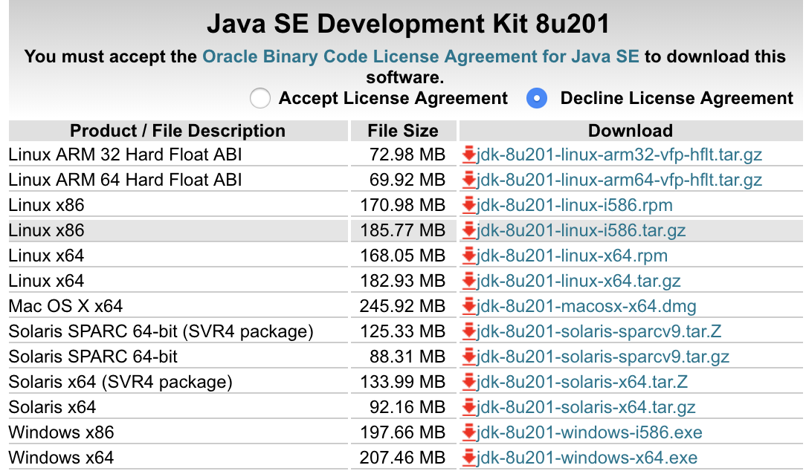
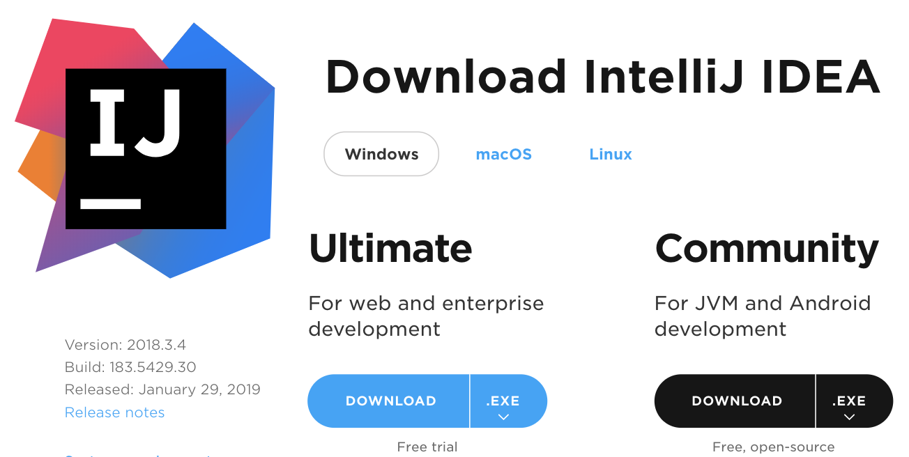
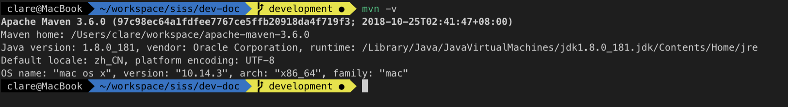

# 第一章 JAVA开发环境的搭建

## 1 安装开发环境

俗话说的好，工欲善其事，必先利其器，一个好的工具是Java开发的一大利器，我们选择社区使用最广泛的代码管理工具Git和集成开发工具IDEA IDE。

### 1.1 安装JDK

* [下载 JDK 1.8](https://www.oracle.com/technetwork/java/javase/downloads/jdk8-downloads-2133151.html)


打开页面,点击`Accept License Agreement`。

`windows 64位` 点击 `jdk-8u201-windows-x64.exe`

`windows 32位` 点击 `jdk-8u201-windows-i586.exe`

* 安装

  JDK 安装在安装官方指引安装即可，安装完毕确认以下几点
  1. 环境变量 JAVA_HOME
  2. 在终端下确认Java的版本

```bash
java -version

java version "1.8.0_31"
Java(TM) SE Runtime Environment (build 1.8.0_31-b13)
Java HotSpot(TM) 64-Bit Server VM (build 25.31-b07, mixed mode)
```  

### 1.2 开发工具的安装

* [下载 IDEA IDE](https://www.jetbrains.com/idea/download)

 (要求 IDEA IDE 2016.3.0 或以上版本)

* 安装
IDEA IDE 的安装较为简单，确实安装就行了。

### 1.3 安装浏览器 && 接口调试工具 Postman

* 作为Java开发者，使用什么浏览器能提供你的工作效率呢，我推荐Chrome，或者以Chrome为内核的其它浏览器，用chrome的目的是里面有很多开发用的工具及插件，如Postman。

### 1.4 安装及配置Maven仓库

* [下载 Maven](http://mirrors.tuna.tsinghua.edu.cn/apache/maven/maven-3/3.6.0/binaries/apache-maven-3.6.0-bin.zip)

* Maven的配置

将安装包下载后并解压至当前目录,设置Maven的环境变量 `MAVEN_HOME=D:\mvn\apache-maven-3.6.0`
PATH中添加`D:\mvn\apache-maven-3.6.0\bin`

验证maven是否安装成功：

命令行 `mvn -v`



更换maven中的 `settings.xml` 下载 [settings.xml](pkg/settings.xml) 替换解压包下的conf中的`settings.xml` 并设置环境变量`NEXUS_PATH=http://nexus.sixunyun.com.cn`。
