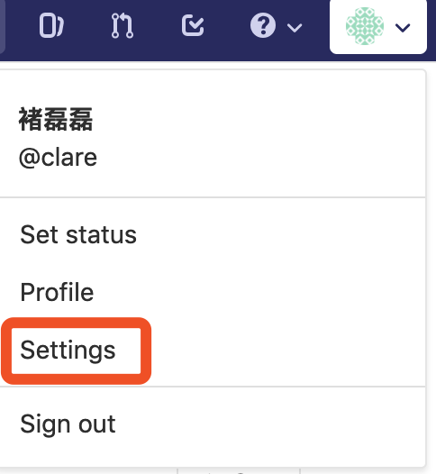
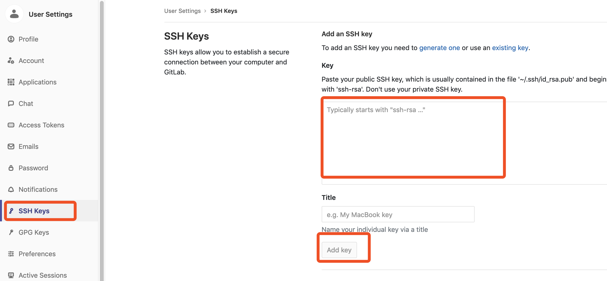

# 2 GIT 的使用

## 2.1 概述

如果你严肃对待编程，就必定会使用"版本管理系统"（Version Control System）。
眼下最流行的"版本管理系统"，非Git莫属。


相比同类软件，Git有很多优点。其中很显著的一点，就是版本的分支（branch）和合并（merge）十分方便。有些传统的版本管理软件，分支操作实际上会生成一份现有代码的物理拷贝，而Git只生成一个指向当前版本（又称"快照"）的指针，因此非常快捷易用。
但是，太方便了也会产生副作用。如果你不加注意，很可能会留下一个枝节蔓生、四处开放的版本库，到处都是分支，完全看不出主干发展的脉络。


Vincent Driessen提出了一个分支管理的策略，我觉得非常值得借鉴。它可以使得版本库的演进保持简洁，主干清晰，各个分支各司其职、井井有条。理论上，这些策略对所有的版本管理系统都适用，Git只是用来举例而已。如果你不熟悉Git，跳过举例部分就可以了。

## 2.2 Git 的安装

[Git 下载](https://github.com/git-for-windows/git/releases/download/v2.20.1.windows.1/Git-2.20.1-64-bit.exe)

下载成功后直接点击安装即可。

## 2.3 Git 注册及配置

在浏览器输入`https://gitlab.sissyun.com.cn` 打开Gitlab客户端

## 2.4 注册

特别注意下面的格式，名字用中文，用户名使用全小写拼音,  并使用公司邮箱。
如果你的名字是：张三，

* 姓名（name）填写中文名：张三
* 用户名（username）填写你的全名拼音：zhangsan
* 邮箱是使用公司邮箱，不要用私人邮箱：zhang.san@ssi.com.

请记住自己设置的密码，要求8位，并包含英文字母大、小写及数字，如：pA5wOldy，如果你没安装要求注册，你将无法登录Gitlab。


## 2.5 激活用户

激活你的账户

接下来去邮箱查看你的邮件，你很快会收到来自 Gitlab 的邮件,按照提示激活你的账户。（如果没收到激活邮件，请联系你的项目经理）

## 2.6 设置密钥

回到操作系统命令提示符下（windows用户请用git bash终端）生成ssh密钥及设置git用户信息, 注意如果你在运行ssh-keygen是设置了密码，那么你以后的git操作也要输入密码，否则这里可以直接回车，即运行ssh-keygen不使用密码。

```bash
ssh-keygen -t rsa -C "zhang.san@ssi.com" 
git config --global user.name "Zhang San"
git config --global user.email "zhang.san@ssi.com"
```

### 2.7 上传公钥

登录gitlab后，先点击 Profile Settings >  



创建`rsa` 密钥

```bash
ssh-keygen -t rsa -C "youname@ssi.com"
```

最好打开密钥管理页面

 在git bash下，复制刚才生成好的ssh公共密钥的文本内容并粘贴到下面文本框内

* Windows：c:\Users\yourname\.ssh\id_rsa.pub; 
* Linux/Mac: ~/.ssh/id_rsa.pub

```bash

cat ~/.ssh/id_rsa.pub
```



### 2.8 编辑Git配置文件

我们来克隆一个演示应用代码下来测试

```bash
git clone ssh://git@gitlab.sissyun.com.cn:8022/frameworks/spring-boot-utils.git
```

### 2.9 Git 使用入门

说明：

以下所有git命令行都在终端下操作。

**创建分支**

创建一个名称叫 demo

```bash
git checkout -b demo
```

**查看创建的分支**

```bash
git branch –a
```

**查看本地文件修改状态**

接下来就可以开发了，开发完成后查看更改过的文件

```bash
git status
```

**代码提交**
审查没有问题后提交代码到 feature 分支

```bash
git add .

git status

git commit

(press i to input below text)

[Description]: Your comments.

[Reviewer]: The name of reviewer

(press esc and :wq to commit )
```

把提交到代码推到远程服务器

```bash
git push origin demo
```

**主分支master**

首先，代码库应该有一个、且仅有一个主分支。所有提供给用户使用的正式版本，都在这个主分支上发布。

Git主分支的名字，默认叫做master。它是自动建立的，版本库初始化以后，默认就是在主分支在进行开发。

**开发分支development**

主分支只用来分布重大版本，日常开发应该在另一条分支上完成。我们把开发用的分支，叫做development, 开发功能模块应该新建feature分支，单元测试通过后合并到development分支，合并完成后feature分支到生命周期结束，应该删除该分支。

这个分支可以用来生成代码的最新隔夜版本（nightly）。如果想正式对外发布，就在Master分支上，对Development分支进行"合并"（merge）。
Git创建Development分支的命令：

```bash
git checkout -b development
```

将Development分支发布到Master分支的命令：

```bash
# 切换到Master分支
git checkout master

# 对Development分支进行合并
git merge --no-ff development
```

这里稍微解释一下，上一条命令的--no-ff参数是什么意思。默认情况下，Git执行"快进式合并"（fast-farward merge），会直接将Master分支指向Develop分支。

使用--no-ff参数后，会执行正常合并，在Master分支上生成一个新节点。为了保证版本演进的清晰，我们希望采用这种做法。关于合并的更多解释，请参考Benjamin Sandofsky的《Understanding the Git Workflow》。

**临时性分支**

前面讲到版本库的两条主要分支：Master和Development。前者用于正式发布，后者用于日常开发。其实，常设分支只需要这两条就够了，不需要其他了。
但是，除了常设分支以外，还有一些临时性分支，用于应对一些特定目的的版本开发。临时性分支主要有三种：

* 功能（feature）分支
* 预发布（release）分支
* 修补bug（fixbug）分支

这三种分支都属于临时性需要，使用完以后，应该删除，使得代码库的常设分支始终只有Master和Development。

**功能分支**

接下来，一个个来看这三种"临时性分支"。
第一种是功能分支，它是为了开发某种特定功能，从Development分支上面分出来的。开发完成后，要再并入Development。

功能分支的名字，可以采用feature-*的形式命名。
创建一个功能分支：

```bash
git checkout -b feature-x development
```

开发完成后，将功能分支合并到development分支：

```bash
git checkout development
git merge --no-ff feature-x
```

删除feature分支：

```bash
git branch -d feature-x
```

**2.2.3.5 预发布分支**

第二种是预发布分支，它是指发布正式版本之前（即合并到Master分支之前），我们可能需要有一个预发布的版本进行测试。
预发布分支是从Development分支上面分出来的，预发布结束以后，必须合并进Development和Master分支。它的命名，可以采用release-*的形式。
创建一个预发布分支：

```bash
git checkout -b release-1.0.0 development
```

确认没有问题后，合并到master分支：

```bash
git checkout master
git merge --no-ff release-1.0.0
# 对合并生成的新节点，做一个标签
git tag -a 1.0.0
```

再合并到development分支：

```bash
git checkout development
git merge --no-ff release-1.0.0
```

最后，删除预发布分支：

```bash
git branch -d release-1.0.0
```

**修补bug分支**

第三种是修补bug分支。软件正式发布以后，难免会出现bug。这时就需要创建一个分支，进行bug修补。
修补bug分支是从Master分支上面分出来的。修补结束以后，再合并进Master和Development分支。它的命名，可以采用fixbug-*的形式。

创建一个修补bug分支：

```bash
　　git checkout -b fixbug-0.1 master
```

修补结束后，合并到master分支：

```bash
　　git checkout master
　　git merge --no-ff fixbug-0.1
　　git tag -a 0.1.1
```

再合并到development分支：

```bash
　　git checkout development
　　git merge --no-ff fixbug-0.1
```

最后，删除"修补bug分支"：

```bash
　　git branch -d fixbug-0.1
```

**客户稳定版分支**

当应用发布给多个客户上线时，我们需要从master创建客户分支 abc-xxx
分支是从 master 分支上面分出来的，它的命名，可以采用abc-xxx的形式（abc为客户项目代码, xxx为版本号）。

创建一个预发布分支：

```bash
　　git checkout -b abc-1.0.0 master
```

测试有问题就在这个分支收敛再提交测试，最后测试没有问题，以此版本发布。
