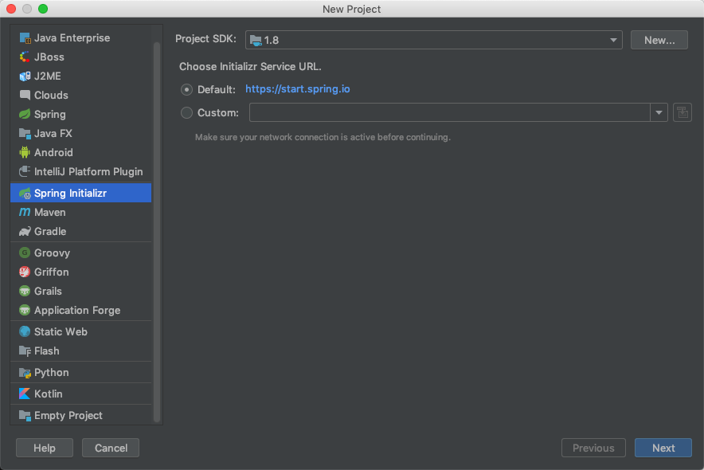
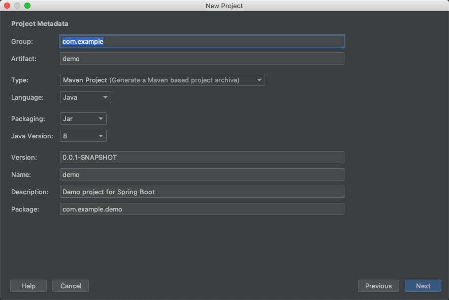
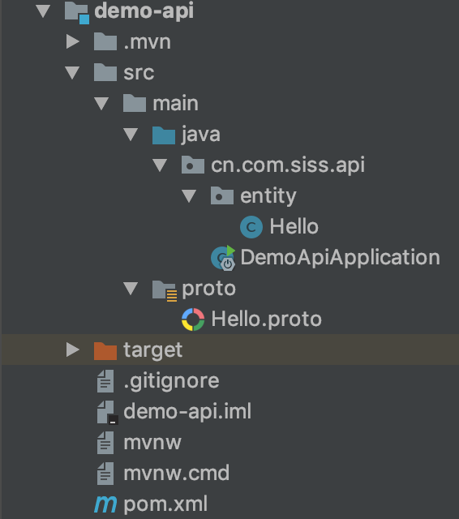

# GRPC的使用

## 简介

grpc 由 google 开发,是一款语言中立、平台中立、开源的远程过程调用(RPC)系统。它是一个高性能、开源和通用的RPC框架，面向移动和HTTP/2设计。
目前提供C、Java和Go语言版本，分别是grpc、grpc-java、grpc-go。
gRPC基于HTTP/2标准设计，带来诸如双向流、流控、头部压缩、单TCP连接上的多复用请求等特性。


## grpc的使用

本章主要结合`java`中 的SpringBoot 集成 grpc而展开。

首先通过`ideal`创建一个`springboot`的项目。



填写 `包名` `组名`等基本信息。



创建好项目后 修改 pom.xml

```xml
<!-- 父包名称 -->
    <parent>
        <groupId>cn.com.siss</groupId>
        <artifactId>spring-boot-starters</artifactId>
        <version>0.0.1-SNAPSHOT</version>
        <relativePath/> <!-- lookup parent from repository -->
    </parent>

    <groupId>cn.com.siss</groupId>
    <artifactId>demo-grpc</artifactId>
    <version>0.0.1-SNAPSHOT</version>
    <name>demo-grpc</name>

     <!-- packaging 为 pom -->
    <packaging>pom</packaging>

    <!-- 子模块 -->
    <modules>
        <module>demo-api</module>
        <module>demo-provider</module>
        <module>demo-web</module>
    </modules>

    <dependencies>
        <dependency>
            <groupId>org.springframework.boot</groupId>
            <artifactId>spring-boot-starter</artifactId>
        </dependency>
        <dependency>
            <groupId>org.springframework.boot</groupId>
            <artifactId>spring-boot-starter-web</artifactId>
        </dependency>
        <dependency>
            <groupId>org.springframework.boot</groupId>
            <artifactId>spring-boot-starter-test</artifactId>
            <scope>test</scope>
        </dependency>
        <dependency>
            <groupId>cn.com.siss</groupId>
            <artifactId>spring-boot-starter-grpc</artifactId>
            <version>0.0.1-SNAPSHOT</version>
        </dependency>
        <dependency>
            <groupId>cn.com.siss.utils</groupId>
            <artifactId>siss-utils</artifactId>
            <version>0.0.1-SNAPSHOT</version>
        </dependency>
    </dependencies>

    <build>
        <plugins>
            <plugin>
                <groupId>org.springframework.boot</groupId>
                <artifactId>spring-boot-maven-plugin</artifactId>
            </plugin>
        </plugins>
    </build>
```

添加子模块

`demo-api` 该模块主要存放`实体类` `proto文件`



修改 `demo-api` 的 pom.xml

```xml
<!-- 修改parent -->
    <parent>
        <groupId>cn.com.siss</groupId>
        <artifactId>demo-grpc</artifactId>
        <version>0.0.1-SNAPSHOT</version>
    </parent>
<!-- 添加依赖 -->
        <dependencies>
        <dependency>
            <groupId>org.springframework.boot</groupId>
            <artifactId>spring-boot-starter</artifactId>
        </dependency>

        <dependency>
            <groupId>org.springframework.boot</groupId>
            <artifactId>spring-boot-starter-test</artifactId>
            <scope>test</scope>
        </dependency>
        <dependency>
            <groupId>org.springframework.boot</groupId>
            <artifactId>spring-boot-starter-test</artifactId>
            <scope>test</scope>
        </dependency>
    </dependencies>

<!-- 添加插件 -->

    <build>
        <plugins>
            <plugin>
                <groupId>org.springframework.boot</groupId>
                <artifactId>spring-boot-maven-plugin</artifactId>
                <configuration>
                    <classifier>exec</classifier>
                </configuration>
            </plugin>
            <plugin>
                <groupId>org.xolstice.maven.plugins</groupId>
                <artifactId>protobuf-maven-plugin</artifactId>
            </plugin>
            <plugin>
                <groupId>org.sonarsource.scanner.maven</groupId>
                <artifactId>sonar-maven-plugin</artifactId>
            </plugin>
            <plugin>
                <groupId>org.jacoco</groupId>
                <artifactId>jacoco-maven-plugin</artifactId>
            </plugin>
        </plugins>
    </build>
```

`demo-web` 对外提供接口

对外api

```java
@RestController
public class HelloWorld {

    @Autowired
    private HelloRpcService helloRpcService;

    @RequestMapping(value = "/", method = RequestMethod.GET)
    public String get(){
        System.out.println("controller get method");
        String b = helloRpcService.get("qq");
        return b;
    }
}
```

rpc层对java对象转化为proto流文件

```java
@Service
@Slf4j
@AllArgsConstructor
public class HelloRpcService {
    private HelloServiceGrpc.HelloServiceBlockingStub blockingStub;

    public String get(String name) {
        Hello hello = new Hello();
        hello.setName(name);
        HelloProto.HelloDTO dto = (HelloProto.HelloDTO) toGRpcMessage(hello, HelloProto.HelloDTO.newBuilder());
        HelloProto.HelloDTO rep = blockingStub.get(dto);
        String say = (String) fromGRpcMessage(rep, String.class);
        return say;
    }
}
```

定义`protobuf`

```protobuf
syntax = "proto3";

option java_package = "cn.com.siss.api";
option java_outer_classname = "HelloProto";

message HelloDTO {
    string name = 1;
}

service HelloService {
    rpc get (HelloDTO) returns (HelloDTO) {}
}
```

添加`config`文件注册

```java
@Configuration
@EnableAutoConfiguration
public class HelloConfig {

    @GRpcClient("demo-provider")
    private ManagedChannel channel;

    @Bean
    public HelloServiceGrpc.HelloServiceBlockingStub helloServiceBlockingStub(){
        return HelloServiceGrpc.newBlockingStub(channel);
    }
}
```

修改application.yml

```yaml
grpc:
  client:
    demo-provider:
      server-host: localhost
      server-port: 7575
      enable-keep-alive: true
      keep-alive-delay: 60 # seconds
      keep-alive-timeOut: 60
```

`demo-provider` 对数据做持久化

修改pom文件

```xml

    <parent>
        <groupId>cn.com.siss</groupId>
        <artifactId>demo-grpc</artifactId>
        <version>0.0.1-SNAPSHOT</version>
    </parent>
    <!-- 添加依赖 -->
        <dependencies>
        <dependency>
            <groupId>org.springframework.boot</groupId>
            <artifactId>spring-boot-starter</artifactId>
        </dependency>
        <dependency>
            <groupId>org.springframework.boot</groupId>
            <artifactId>spring-boot-starter-web</artifactId>
        </dependency>
        <dependency>
            <groupId>org.springframework.boot</groupId>
            <artifactId>spring-boot-starter-test</artifactId>
            <scope>test</scope>
        </dependency>
        <dependency>
            <groupId>cn.com.siss</groupId>
            <artifactId>demo-api</artifactId>
            <version>0.0.1-SNAPSHOT</version>
        </dependency>
    </dependencies>

    <build>
        <plugins>
            <plugin>
                <groupId>org.springframework.boot</groupId>
                <artifactId>spring-boot-maven-plugin</artifactId>
            </plugin>
        </plugins>
    </build>

```

rpc层

```java
@Slf4j
@GRpcService
public class HelloRpc extends HelloServiceGrpc.HelloServiceImplBase {

    @Override
    public void get(HelloProto.HelloDTO request,
                    StreamObserver<HelloProto.HelloDTO> responseObserver) {
        HelloProto.HelloDTO response = (HelloProto.HelloDTO) toGRpcMessage(request, HelloProto.HelloDTO.newBuilder());
        responseObserver.onNext(response);
        responseObserver.onCompleted();
    }

}
```

可以尝试下载demo debug一下

```bash
git clone ssh://git@gitlab.sissyun.com.cn:8022/demo/demo-grpc.git
```