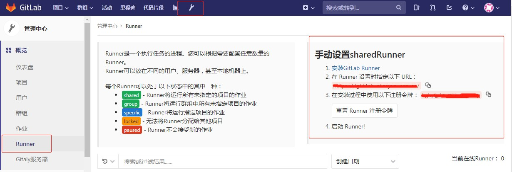
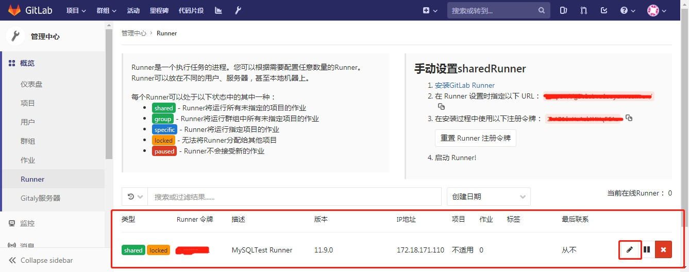
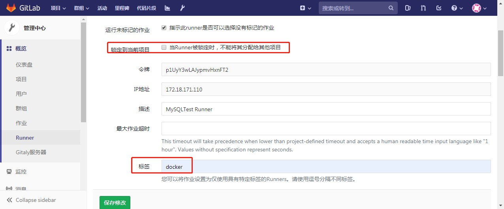

# GitLab CI/CD环境搭建

## 简述

GitLab现已集成CI/CD功能。默认每个项目，都会自动启用CI/CD功能。但要使用，还需要配合Gitlab-Runner才可正常运行。Gitlab只是将具体工作交给Gitlab-Runner.

## Gitlab Runner安装

### GitLab Runner类型

- 共享GitLab Runner
  
  共享的可以看成是全局的，所有项目都可使用

- 项目GitLab Runner

   只运行指定项目的CI/CD工作。

### 获取注册信息

以管理员身份进入GitLab控制台，进入"管理中心" ---> "概览" ---> "Runnner"菜单，获取注册地址与注册Token

有了以上信息后，我们就可以编写一个Docker-compose文件，来启动GitLab Runner了。

### 编写服务文件

docker-compose.yaml

```yaml
gitlab-runner:
  container_name: gitlab-runner
  image: gitlab/gitlab-runner:latest
  restart: always
  net: "host"
  privileged: true
  volumes:
    # 配置文件持久化
    - ./config.toml:/etc/gitlab-runner/config.toml:rw
    # 因为使用Docker里面运行Docker,挂载进去
    - /var/run/docker.sock:/var/run/docker.sock
```

编写好后，启动Gitlab Runner

```bash
docker-compose up -d
# 进入容器后，在容器里面执行以下内容，进入注册
gitlab-runner register -n \
   --url https://URL/ \
   --registration-token Token \
   --executor docker \
   --description "MySQLTest Runner" \
   --docker-image "docker:stable" \
   --docker-privileged
```

注册成功后，会发现config.toml文件有相应的修改，根据实际情况进行调整

config.toml

```yaml
# 完整可用配置项
# https://docs.gitlab.com/runner/configuration/advanced-configuration.html
# 并发限制，限制同时工作的数量，0为禁用
concurrent = 0
check_interval = 0

[session_server]
  session_timeout = 1800

[[runners]]
  name = "MySQLTest Runner"
  # 注册后的URL，不要修改
  url = "URL"
  # 该Token是注册后的Token,不要修改
  token = "TOKEN"
  # 执行器为docker，不同的执行器能使用的命令是不同，详细要查看官网
  executor = "docker"
  # 定义全局变量
  environment = ["ENV1=VALUE1", "ENV2=VALUE2"]
  [runners.docker]
    tls_verify = false
    image = "docker:stable"
    privileged = true
    disable_entrypoint_overwrite = false
    oom_kill_disable = false
    disable_cache = false
    # 作业容器的卷挂载,这里因为要使用内网地址，将本机的HOSTS挂载进容器
    volumes = ["/cache", "/etc/hosts:/etc/hosts:rw"]
    shm_size = 0
  [runners.cache]
    [runners.cache.s3]
    [runners.cache.gcs]
```

将GitLab Runner运行起来后，进入GitLab的"管理中心" --> "Runner"页面，会自动有GitLab Runner注册上来。

虽然GitLab Runner已注册上来，默认注册上来的Runner是锁定到当前项目的。因此还需要做一些小设置。

- 取消锁定到当前项目
  
- 给该GitLab Runner增加一个标签



## GitLab配置

在每个项目的根目录下面，都需要创建`.gitlab-ci.yml`文件，该文件就是定义GitLab Runner CI/CD所要做的具体工作。

示例文件

```yaml
# 完整指南：
# https://docs.gitlab.com/ee/ci/yaml/README.html
variables:
  MAVEN_MIRROR_URL: "http://172.18.171.113/repository/maven-public/"
  REGISTRY: "registry-vpc.cn-shenzhen.aliyuncs.com/siss"
  TAG: "0.0.7-SNAPSHOT-test"

services:
  - docker:dind

before_script:
  - echo "Befor run build"

stages:
  - build
  - docker

build:jar:
  image: sissyun/base-java
  stage: build
  only:
    - master
    - development
  script:
    - pwd && mkdir tmp
    - mvn clean install
    - cp target/*.jar  tmp && cd tmp
    - ls | xargs -t -i mv {} app.jar
  artifacts:
    expire_in: 10min
    paths:
      - tmp
  tags:
    # 该TAG是表示GitLab Runner的Tag，必须指定
    - docker

docker:info:
  image: docker:stable-dind
  stage: docker
  only:
    - master
    - development
  script:
     - docker login -u ${DOCKER_ENV_USER} -p ${DOCKER_ENV_PASS}  ${REGISTRY}
     - echo FROM  registry-vpc.cn-shenzhen.aliyuncs.com/siss/base-image-java:0.1 > Dockerfile
     - echo 'ENV  TZ="Asia/Shanghai"  APP_OPTIONS="-Xms128m -Xmx512m -Xss512k"' >> Dockerfile
     - echo WORKDIR ${APP_HOME:-/opt/app-root/src/} >> Dockerfile
     - echo COPY tmp/app.jar ${APP_HOME:-/opt/app-root/src/} >> Dockerfile
     - echo ENTRYPOINT  [\"sh\",\"-c\",\"java -jar ${APP_HOME:-/opt/app-root/src}/app.jar $APP_OPTIONS\"] >> Dockerfile
     - cat Dockerfile
     - export DOCKER_HOST=${DOCKER_PORT}
     - docker build -t ${REGISTRY}/${CI_PROJECT_NAMESPACE}_${CI_PROJECT_NAME}:${TAG} .
     - docker push ${REGISTRY}/${CI_PROJECT_NAMESPACE}_${CI_PROJECT_NAME}:${TAG}
  tags:
    - docker
  dependencies:
    - build:jar
```

以上，每当项目有提交，会自动触发`.gitlab-ci.yml`文件中定义的工作流。可以在"管理中心"--->"作业"中看到CI/CD的工作详情与日志。

