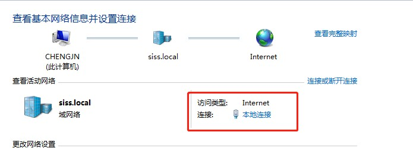
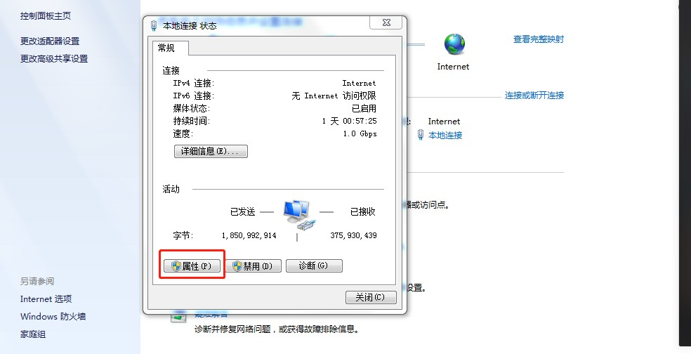
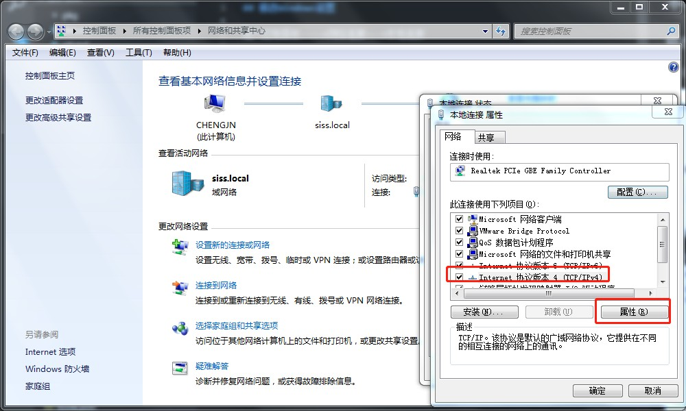
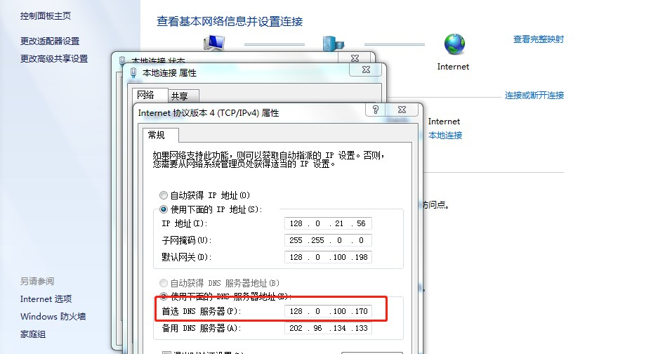
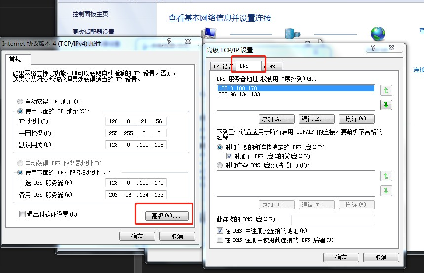
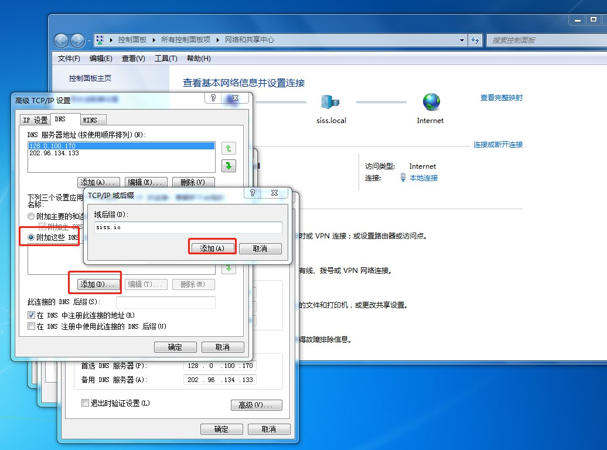
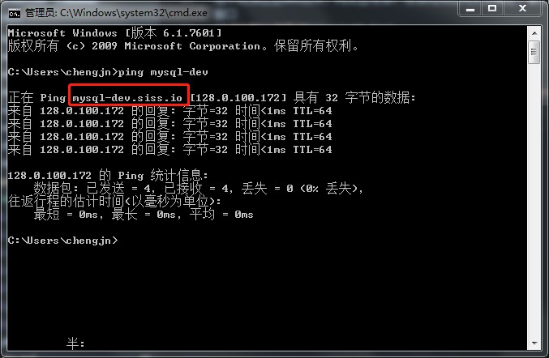

# 本地开发环境基础服务支持使用DNS设置方法

## 修改Windows设置

进入控制面板---->网络连接--->本地连接

在弹出的菜单中，点击属性按钮

弹出的菜单中，先选中Internet协议版本4---再点击属性

将首选DNS修改为128.0.100.170

再点击高级按钮,弹出的对话框切换到DNS选项卡，如下图所示

选中附加这些DNS后续，再点击添加。添加完成后再点击确定，最后依次关闭当前窗口

## 测试

打开终端命令行窗口，执行`ping mysql-dev`,应该会自动将`mysql-dev`转换为`mysql-dev.siss.io`该域名，并正确返回IP地址

附:

