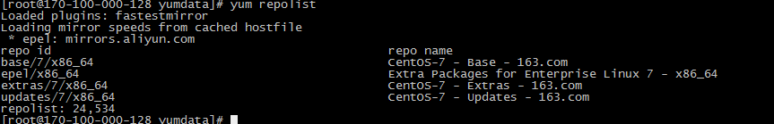

# 本地YUM源搭建

Linux系统的包管理是`yum`。默认刚安装好的系统一般都是从CentOS官方下载相关软件包，这样就会浪费很多带宽。

## 服务端配置

```bash
# 安装yum-utils
yum install yum-utils createrepo  nginx -y

# 准备存储YUM源数据的文件夹
mkdir -p /data/yumdata
```

同步脚本下载

[syncRepo.sh](./pkg/syncRepo.sh)

```bash
yum repolist
```



```bash
# 执行脚本，同步yum源以及生成yum源数据
cd /data/yumdata
chmod +x syncRepo.sh
sh syncRepos.h

# 修改NGINX配置文件,将同步至本地的YUM通过HTTP给内部使用
vi /etc/nginx/nginx.conf
...
location / {
    autoindex on;
    root /data/yumdata/;
}

# 开启NGINX
systemctl enable nginx && systemctl start nginx

# 加入定时任务，每天自动同上层yu
vim /etc/crontab
2 3 * * * root /data/yumdata/syncRepo.sh
```

## 客户端配置

1. 先备份系统原有的repo文件

    ```bash
    cd /etc/yum.repos.d && mkdir backup
    mv *.repo backup
    ```

2. 在/etc/yum.repos.d/目录下新建本地YUM源的文件

   ```bash
   vim /etc/yum.repos.d/local.repo

   [centos-base]
   name=CentOS-Base
   baseurl=http://128.0.100.170/base/
   enable=1
   gpgcheck=0

   [centos-update]
   name=CentOS-Update
   baseurl=http://128.0.100.170/updates/
   enable=1
   gpgcheck=0

   [centos-extrals]
   name=CentOS-Extrals
   baseurl=http://128.0.100.170/extras/
   enable=1
   gpgcheck=0

   [docker-ce]
   name=Docker-CE
   baseurl=http://128.0.100.170/docker-ce/
   enable=1
   gpgcheck=0
   ```