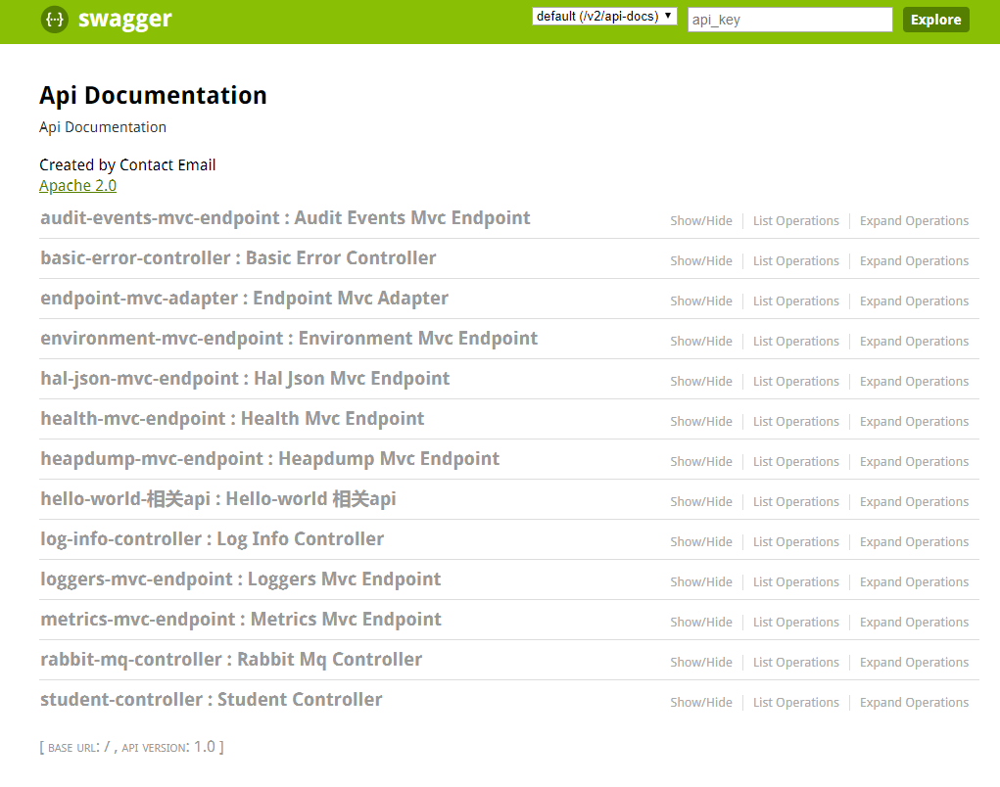

# SpringBoot整合Swagger2

## 前言

手写Api文档的几个痛点：

1. 文档需要更新的时候，需要再次发送一份给前端，也就是文档更新交流不及时。
2. 接口返回结果不明确
3. 不能直接在线测试接口，通常需要使用工具，比如postman
4. 接口文档太多，不好管理
5. Swagger也就是为了解决这个问题，当然也不能说Swagger就一定是完美的，当然也有缺点，最明显的就是代码移入性比较强。

## 使用

在`pom.xml`中添加依赖

```xml
<dependency>
	<groupId>io.springfox</groupId>
	<artifactId>springfox-swagger2</artifactId>
	<version>2.6.1</version>
</dependency>


<dependency>
	<groupId>io.springfox</groupId>
	<artifactId>springfox-swagger-ui</artifactId>
	<version>2.6.1</version>
</dependency>
```

在启动类中添加swagger 开关

```java
@SpringBootApplication
@EnableSwagger2
public class SpringbootSwagger2Application {

public static void main(String[] args) {
	SpringApplication.run(SpringbootSwagger2Application.class, args);
}
}
```

### 测试的demo

```java
@RestController
@Api("Hello-world 相关api")
public class HelloWorld {

    @Autowired
    private HelloRpcService helloRpcService;

    @Autowired
    private RedisTemplate redisTemplate;

    @Autowired
    private KafkaTemplate kafkaTemplate;

    @ApiOperation("调用rpc服务")
    @ApiImplicitParams({
            @ApiImplicitParam(paramType="header",name="username",dataType="String",required=true,value="用户的姓名",defaultValue="xxxx"),
            @ApiImplicitParam(paramType="query",name="password",dataType="String",required=true,value="用户的密码",defaultValue="xxxxxxxxxxxx")
    })
    @ApiResponses({
            @ApiResponse(code=400,message="请求参数没填好"),
            @ApiResponse(code=404,message="请求路径没有或页面跳转路径不对"),
            @ApiResponse(code=500,message="服务器异常")
    })
    @RequestMapping(value = "/qq", method = RequestMethod.POST)
    public Object get(@RequestBody User user){
        System.out.println("controller get method");
        Hello b = helloRpcService.get("qq");
        return b;
    }
}
```

得到一下效果




### Swagger注解

swagger通过注解表明该接口会生成文档，包括接口名、请求方法、参数、返回信息的等等。

@Api：修饰整个类，描述Controller的作用
@ApiOperation：描述一个类的一个方法，或者说一个接口
@ApiParam：单个参数描述
@ApiModel：用对象来接收参数
@ApiProperty：用对象接收参数时，描述对象的一个字段
@ApiResponse：HTTP响应其中1个描述
@ApiResponses：HTTP响应整体描述
@ApiIgnore：使用该注解忽略这个API
@ApiError ：发生错误返回的信息
@ApiImplicitParam：一个请求参数
@ApiImplicitParams：多个请求参数